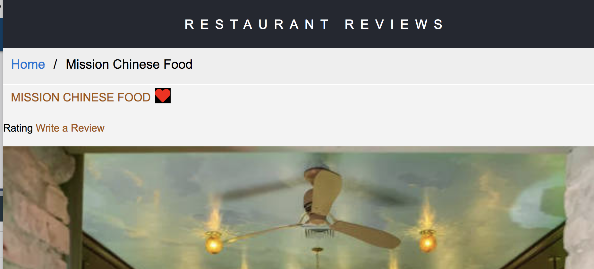
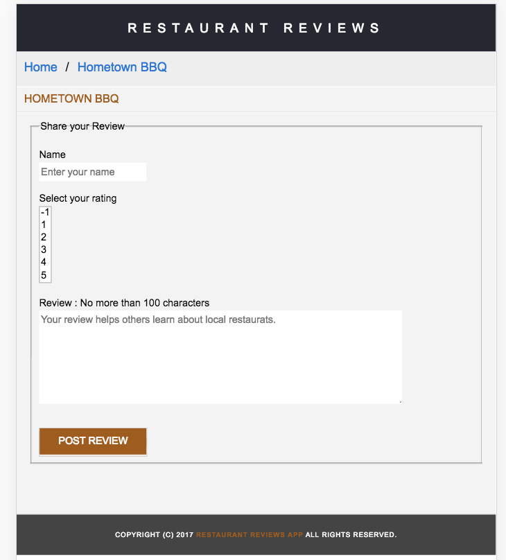
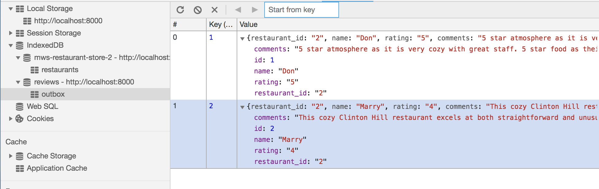
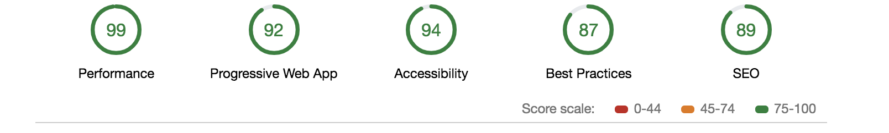
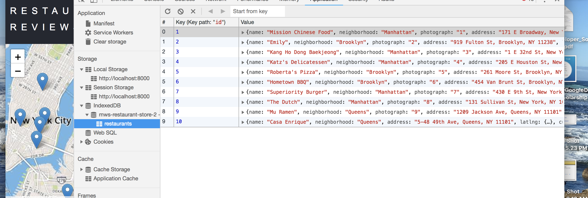
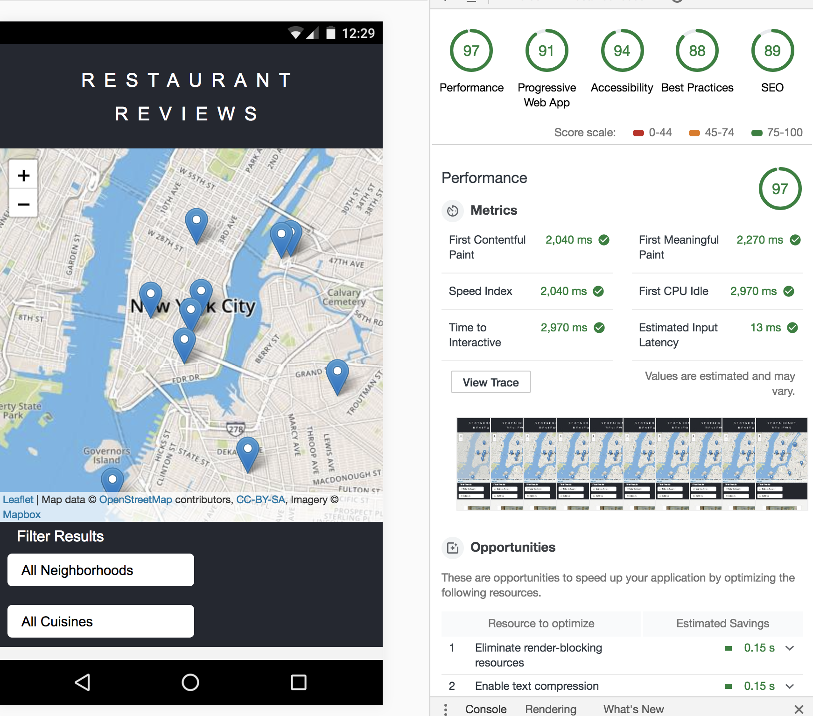
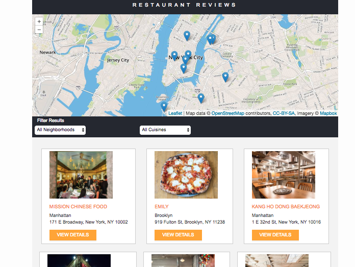
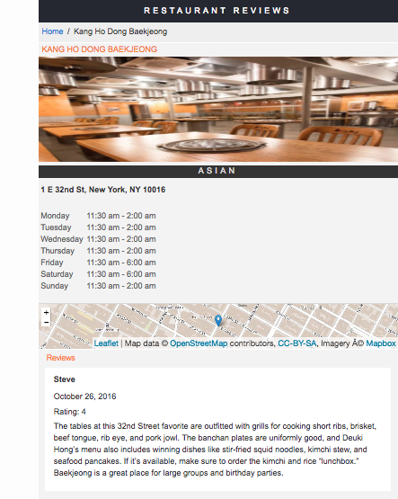
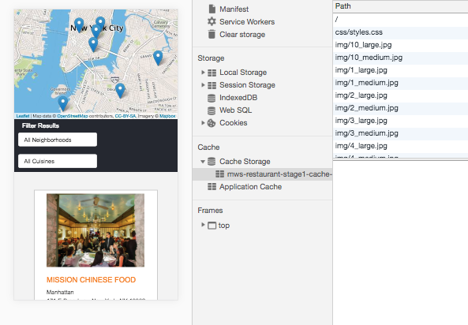

# Mobile Web Specialist Certification Course
---
## Restaurant Reviews: Stage 3

#### Functionality

Users are able to mark a restaurant as a favorite, this toggle is visible in the application.

A form is added to allow users to add their own reviews for a restaurant. Form submission works properly and adds a new review to the database.

#### Offline Use

The client application works offline. JSON responses are cached using the IndexedDB API. Any data previously accessed while connected is reachable while offline. User is able to add a review to a restaurant while offline and the review is sent to the server when connectivity is re-established.

#### Responsive Design and Accessibility

The application maintains a responsive design on mobile, tablet and desktop viewports. All new features are responsive, including the form to add a review and the control for marking a restaurant as a favorite.

The application retains accessibility features from the previous projects. Images have alternate text, the application uses appropriate focus management for navigation, and semantic elements and ARIA attributes are used correctly. Roles are correctly defined for all elements of the review form.

#### Site Performance

## Restaurant Reviews: Stage 2

For the **Restaurant Reviews** projects

I have used server data instead of local memory by pulling all of the data from the server instead, and using the response data to generate the restaurant information on the main page and the detail page.

#### I used IndexedDB to cache JSON responses in key : value format  

#### Also optimized the file using gulp. The optimized code is stored in the **dist** folder. 

Lighthouse measures performance as :

Progressive Web App score at 90 or better.

Performance score  at 70 or better.

Accessibility score at 90 or better.

## Restaurant Reviews: Stage 1

For the **Restaurant Reviews** projects, I converted a static webpage to a mobile-ready web application. 

I added accessibility and converted the design to be responsive on different sized displays and accessible for screen reader use. 

Also added a service worker to begin the process of creating a seamless offline experience for your users.

### How to run the project

## Download or Clone 

 Download or clone this repository. In the root folder, start up a simple HTTP server to serve up the site files on your local computer. Python has some simple tools to do this, and you don't even need to know Python. For most people, it's already installed on your computer. 

## Leaflet.js and Mapbox:

This repository uses [leafletjs](https://leafletjs.com/) with [Mapbox](https://www.mapbox.com/). You need to replace `<your MAPBOX API KEY HERE>` with a token from [Mapbox](https://www.mapbox.com/). Mapbox is free to use, and does not require any payment information. 

## Running the project
In a terminal, check the version of Python you have: `python -V`. If you have Python 2.x, spin up the server with `python -m SimpleHTTPServer 8000` (or some other port, if port 8000 is already in use.) For Python 3.x, you can use `python3 -m http.server 8000`. If you don't have Python installed, navigate to Python's [website](https://www.python.org/) to download and install the software.

2. With your server running, visit the site: `http://localhost:8000`

### License

The contents of this repository are covered under the MIT License.

